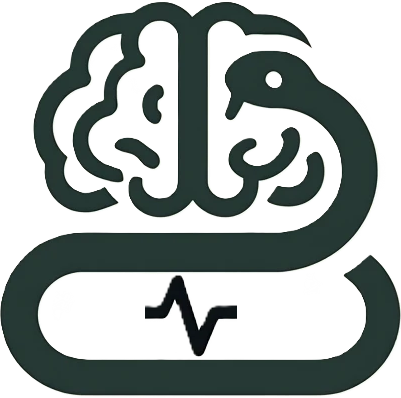
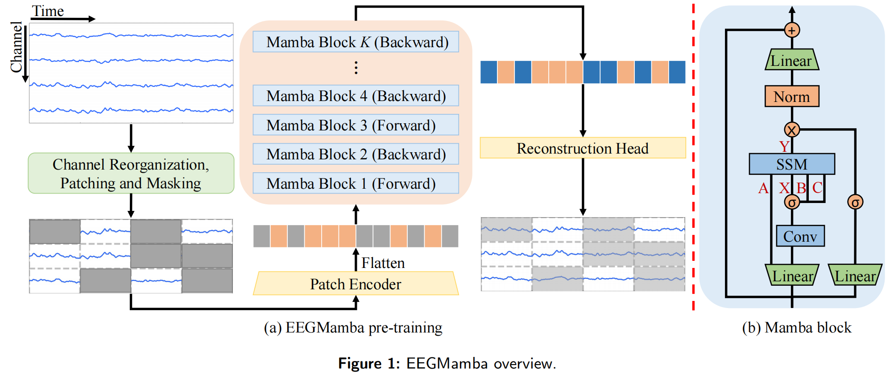

<div align="center">

# EEGMamba


_An EEG Foundation Model with Mamba_


[](https://www.sciencedirect.com/science/article/pii/S0893608025006963)
[](https://huggingface.co/weighting666/EEGMamba)


</div>


<div align="center">

</div>


<p align="center">
    🔍&nbsp;<a href="#-about">About</a>
    | 🔨&nbsp;<a href="#-setup">Setup</a>
    | 🚢&nbsp;<a href="#-pretrain">Pretrain</a>
    | ⛵&nbsp;<a href="#-finetune">Finetune</a>
    | 🚀&nbsp;<a href="#-quick-start">Quick Start</a>
    | 🔗&nbsp;<a href="#-citation">Citation</a>
</p>

💡 NOTING: This repository is implemented based on the [CBraMod](https://github.com/wjq-learning/CBraMod) repository. 
Although in the EEGMamba paper we only evaluated 6 downstream datasets, 
to facilitate further evaluation by the community, we have also provided 
evaluation code for all the downstream datasets used in the CBraMod paper. 
Thank you for your support of [CBraMod](https://github.com/wjq-learning/CBraMod) and EEGMamba.

🔥 NEWS: The paper "_EEGMamba: An EEG Foundation Model with Mamba_" has been accepted by Neural Networks!

## 🔍 About
We propose **EEGMamba**, a novel EEG foundation model based on Mamba state space model, for EEG decoding on various clinical and BCI application.
The camera-ready version of the paper will be available at [Neural Networks](https://www.sciencedirect.com/science/article/pii/S0893608025006963).
<div align="center">

</div>


## 🔨 Setup
Install [Python](https://www.python.org/downloads/).

Install [PyTorch](https://pytorch.org/get-started/locally/).

Install [Mamba](https://github.com/state-spaces/mamba)

Install other requirements:
```commandline
pip install -r requirements.txt
``` 


## 🚢 Pretrain
You can pretrain EEGMamba on our pretraining dataset or your custom pretraining dataset using the following code:
```commandline
python pretrain_main.py
```
We have released a pretrained checkpoint on [Hugginface🤗](https://huggingface.co/weighting666/EEGMamba).

## ⛵ Finetune
You can finetune EEGMamba on our selected downstream datasets using the following code:
```commandline
python finetune_main.py
```


## 🚀 Quick Start
You can fine-tune the pretrained EEGMamba on your custom downstream dataset using the following example code:
```python
import torch
import torch.nn as nn
from models.eegmamba import EEGMamba
from einops.layers.torch import Rearrange

device = torch.device("cuda:0" if torch.cuda.is_available() else "cpu")
model = EEGMamba().to(device)
model.load_state_dict(torch.load('pretrained_weights/pretrained_weights.pth', map_location=device))
model.proj_out = nn.Identity()
classifier = nn.Sequential(
  Rearrange('b c s p -> b (c s p)'),
  nn.Linear(22*4*200, 4*200),
  nn.ELU(),
  nn.Dropout(0.1),
  nn.Linear(4 * 200, 200),
  nn.ELU(),
  nn.Dropout(0.1),
  nn.Linear(200, 4),
).to(device)

# mock_eeg.shape = (batch_size, num_of_channels, time_segments, points_per_patch)
mock_eeg = torch.randn((8, 22, 4, 200)).to(device)

# logits.shape = (batch_size, num_of_classes)
logits = classifier(model(mock_eeg))
```


## 🔗 Citation
If you're using this repository in your research or applications, please cite using the following BibTeX:
```bibtex
@article{wang2025eegmamba,
  title={EEGMamba: An EEG foundation model with Mamba},
  author={Wang, Jiquan and Zhao, Sha and Luo, Zhiling and Zhou, Yangxuan and Li, Shijian and Pan, Gang},
  journal={Neural Networks},
  pages={107816},
  year={2025},
  publisher={Elsevier}
}

@inproceedings{wang2025cbramod,
    title={{CB}raMod: A Criss-Cross Brain Foundation Model for {EEG} Decoding},
    author={Jiquan Wang and Sha Zhao and Zhiling Luo and Yangxuan Zhou and Haiteng Jiang and Shijian Li and Tao Li and Gang Pan},
    booktitle={The Thirteenth International Conference on Learning Representations},
    year={2025},
    url={https://openreview.net/forum?id=NPNUHgHF2w}
}
```

## ⭐ Star History
<div align="center">
    <a href="https://star-history.com/#wjq-learning/EEGMamba&Date">
        
    </a>
</div>